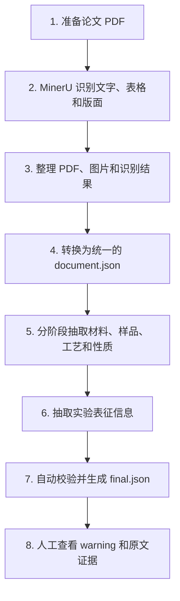

# 高分子文献数据抽取流程

> 本文用来说明这套流程“使用什么工具、完成什么工作、按什么顺序运行”。  

## 1. 这套流程要解决什么问题

高分子论文通常以 PDF 形式保存。论文中的材料名称、制备过程、测试条件和性质数据散落在正文、表格和图片说明中，不便直接统计或检索。

这套流程的目标是把论文从“供人阅读的 PDF”转换成“计算机可以查询的结构化 JSON 数据”，同时保留每条数据在原文中的位置，方便人工核对。

简单来说：

```text
论文 PDF
  → 识别文字和表格
  → 整理为统一格式
  → 用大语言模型逐步提取信息
  → 用程序检查结果
  → 生成可检索、可追溯的 final.json
```

## 2. 使用哪些工具

| 工具 | 主要用途 |
|---|---|
| MinerU | 读取 PDF，识别正文、标题、表格、公式、图片和页面位置 |
| Python 脚本 | 整理文件、转换格式、调度各个抽取阶段并保存结果 |
| 大语言模型（LLM） | 阅读论文内容，识别材料、样品、工艺、性质和表征信息 |
| Prompt 文件 | 告诉大语言模型每一步需要找什么、哪些内容不能猜测 |
| Pydantic 数据模型 | 检查输出字段、数据类型和引用关系是否符合规定 |
| YAML 配置文件 | 集中管理模型、路径、受控词表和各阶段参数 |
| JSON 文件 | 保存每一步的中间结果和最终结果 |

API 密钥只通过本机环境变量读取，不写入配置文件、日志或抽取结果。

## 3. 整体步骤



### 第 1 步：准备论文 PDF

把需要处理的论文放入指定输入目录。建议每篇论文使用稳定的文献编号，例如 `reference_no_0001016.pdf`，这样后续文件可以始终对应同一篇论文。

如果某篇论文已经有完整的 MinerU 输出，可以跳过下一步，避免重复上传和处理。

### 第 2 步：用 MinerU 解析 PDF

使用 `code/ocr/mineru_batch_parse.py`。

MinerU 负责：

- 识别论文正文和标题；
- 识别表格、公式和图片；
- 记录内容位于哪一页、什么位置；
- 保存 Markdown、JSON、原始 PDF 和相关图片。

数字版 PDF 使用默认模式；扫描版 PDF 需要开启 OCR。处理中断后可以根据已有批次编号继续查询，不必重新上传。

### 第 3 步：整理 MinerU 产物

使用 `code/extraction/stage_minus1_reorganize_mineru.py`。

这一步不理解论文内容，只负责把同一篇论文的 PDF、图片和 MinerU 结果放入统一目录，并使用一致的文件名，方便后续程序读取。

整理后的资料保存在：

```text
wenxian/{文献编号}/
```

### 第 4 步：生成统一的文档数据

使用 `code/ocr/transform_mineru_to_standard.py`。

这一步把 MinerU 的多种输出合并成一个统一的 `document.json`，主要工作包括：

- 整理正文、标题、表格、公式和图片的阅读顺序；
- 为每个内容块保留页码和坐标；
- 重建论文的章节，例如摘要、方法和结果；
- 提取题目、作者、期刊、年份和 DOI 等基本信息；
- 对无法可靠对齐的内容做出标记，而不是静默删除。

标准化结果保存在：

```text
processed_data/documents/{文献编号}_document.json
```

### 第 5 步：分阶段抽取论文信息

结构化抽取位于 `code/extraction/stages/`，按顺序执行。后一步会使用前一步的结果。

| 阶段 | 做什么 | 通俗理解 |
|---|---|---|
| Stage 0 | 加载并整理标准文档 | 把论文切成适合后续阅读的内容块 |
| Stage 1 | 识别材料名称 | 找出聚合物名称、缩写、商品名和样品编号 |
| Stage 2 | 建立聚合物实体 | 判断不同叫法是否指向同一种材料，保留不同化学形态 |
| Stage 3 | 提取样品和制备过程 | 说明有哪些真实样品，以及它们经过了哪些合成、加工或处理步骤 |
| Stage 4 | 提取性质和测量条件 | 提取温度、分子量、模量、导电率等结果，并记录测试温度、频率等条件 |
| Stage 5 | 提取表征信息 | 记录 FTIR、NMR、DSC、GPC、XRD、SEM 等实验方法和明确报告的结果 |
| Stage 6 | 合并和检查 | 检查引用、证据和样品关系，合并为最终文件 |

大语言模型主要参与 Stage 1–5。每个阶段都有独立的 Prompt，要求模型只提取论文中明确出现的信息，不能依靠常识补填缺失内容。

### 第 6 步：保存原文证据

每条重要结果都要同时保存原文证据，例如：

- 来自哪一页；
- 来自哪个正文段落或表格；
- 对应的原文句子；
- 在 PDF 页面中的位置；
- 表格中的行、列和单元格。

因此，数据库中的一条性质数据可以追溯回论文原文，而不是只保留一个无法核实的数字。

### 第 7 步：自动校验并生成最终结果

Stage 6 不再调用大语言模型，而是用程序做统一检查，包括：

- 材料、样品、工艺、性质和测试条件之间的引用是否存在；
- 样品的制备过程是否出现矛盾或循环；
- 每条结果是否带有原文证据；
- 表格数据是否保留行、列和值；
- 未能确定的信息是否明确标记；
- 是否存在必须阻止发布的错误。

没有硬错误时，程序生成：

```text
code/extraction/output/{文献编号}/final.json
```

## 4. 最终结果包含什么

`final.json` 会集中保存：

- 论文基本信息；
- 原文中出现的材料名称；
- 归并后的聚合物实体；
- 实际样品及其制备、加工过程；
- 性质数值和测量条件；
- 实验表征方法及相关结果；
- 每条数据对应的原文证据；
- 使用过的工具、模型和 Prompt 记录；
- 自动检查产生的错误和 warning。

中间阶段也各自保存一个 JSON 文件，便于单独检查和从中断处继续运行。

## 5. 人工需要做什么

程序可以完成大部分整理和抽取，但以下情况仍需要人工查看：

- 论文原文表述含糊，无法确定性质属于哪个样品；
- OCR 把化学式、单位或表格识别错了；
- 同一种材料有多个缩写或不同化学形态；
- 程序给出 `unresolved` 或 warning；
- 重要结果准备正式入库或发布。

人工审核时可以根据结果中的页码、原文句子和坐标快速回到 PDF 核对。

## 6. 这套流程的几个原则

1. **不猜测**：论文没有明确写出的信息保持为空或标记为未解决。
2. **可追溯**：重要结果必须能够回到原文或表格。
3. **分步处理**：每一步只做一类工作，便于发现问题和重新运行。
4. **可以续跑**：已有且仍有效的阶段结果会被复用，不必每次从头开始。
5. **先检查再发布**：存在硬错误时不生成可发布的最终结果；warning 留给人工复核。
6. **保护凭据**：API 密钥不进入代码、配置、日志和输出数据。

## 7. 一句话总结

这套流程使用 MinerU 把 PDF 变成可读取的文档结构，再使用 Python 和大语言模型逐步提取材料、样品、工艺、性质和表征信息，最后由程序检查引用和原文证据，生成可查询、可复核的结构化数据。
