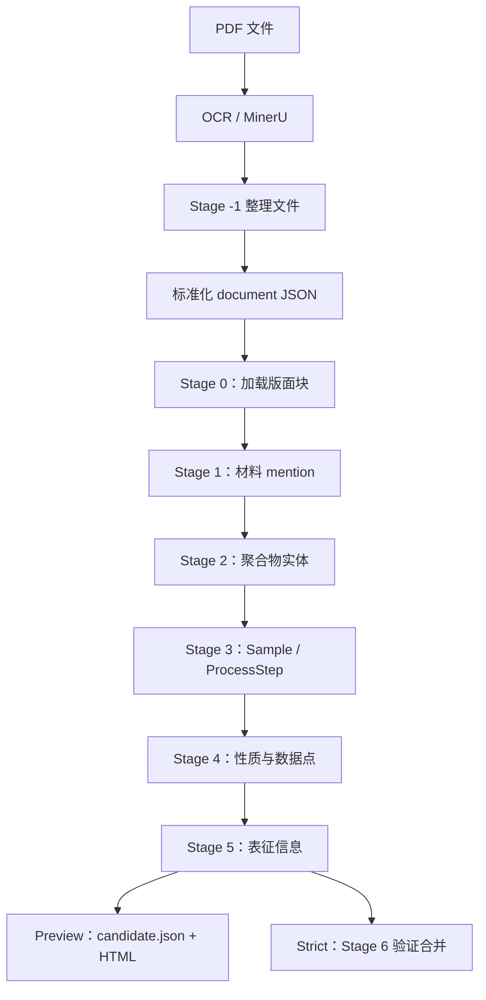

# 聚合物文献结构化抽取项目说明与文件清理建议

> 文档日期：2026-08-07  
> 项目目录：`D:\1work\1_2026\polymer\testcode`  
> 说明范围：OCR/标准化、Stage 0–6 抽取、Preview Candidate、验收、失败回放与本地历史产物。

## 1. 项目目标

本项目用于将聚合物论文转换为可验证、可追溯的结构化数据。流程从 PDF 或标准化文档开始，依次抽取：

- 论文和版面块；
- 材料 mention；
- 聚合物实体；
- Sample 与 ProcessStep；
- 性质、性质序列和数据点；
- 表征方法与表征结果；
- 最终合并结果或 Preview Candidate 报告。

项目的核心原则是：

1. 所有结构化信息尽量保留原文 evidence；
2. 一个 mention 不得同时归属多个实体；
3. 一个 Sample 不得由多个 ProcessStep 同时生成；
4. Strict 模式用于发现数据质量问题；
5. Preview 模式优先保证流程完整生成，但必须用 warning 标记降级、删除或跳过的内容；
6. 无法唯一确定的关系不随意选择“第一个”或“最高置信度”结果。

## 2. 当前验证状态

截至 2026-08-07：

- 固定 20 篇已分批完成 Stage 0–5、`candidate.json` 和 `report_candidate.html`；
- Preview 验收：20/20；
- Strict 验收脚本：20/20；
- 全量自动化测试：416 passed；
- Stage 3 当前实现版本：`1.3.7`；
- 从此前首次未完整完成的 4 篇中随机选择 3 篇，使用全新输出目录、不复用缓存重新运行：
  - 21 个 Stage attempt 全部成功；
  - 0 个 Stage failure；
  - 0 个缓存命中；
  - Preview 与 Strict 均为 3/3。

需要注意：流程跑通不等于所有抽取内容都已达到最终人工标注质量。部分文章仍包含：

```text
preview_degraded_empty_shell
preview_semantic_validation_bypassed
```

这些 warning 是后续数据质量优化清单，不影响 Preview 流程完整发布。

## 3. 总体架构



## 4. Stage 与输出文件

| 阶段 | 主要职责 | 输出文件 | 是否调用 LLM |
|---|---|---|---|
| Stage 0 | 加载标准化文档、版面和元数据 | `stage0_blocks.json` | 否 |
| Stage 1 | 抽取材料 mention | `stage1_mentions.json` | 是 |
| Stage 2 | mention 聚合为聚合物实体 | `stage2_entities.json` | 是 |
| Stage 3 | 抽取 Sample 和 ProcessStep 图 | `stage3_process.json` | 是 |
| Stage 4 | 抽取性质、序列、条件和数据点 | `stage4_properties.json` | 是 |
| Stage 5 | 抽取表征方法和结果 | `stage5_characterizations.json` | 是 |
| Preview 发布 | 合并 Stage 0–5 候选并生成报告 | `candidate.json`、`report_candidate.html` | 否 |
| Stage 6 | Strict 验证与最终合并 | `stage6_validation.json`、`final.json`、`report.html` | 否 |

## 5. 主要目录和文件

### 5.1 总入口

```text
D:\1work\1_2026\polymer\testcode\pipeline_runner.py
```

负责串联：

```text
PDF → MinerU → Stage -1 → 标准化 document JSON → 抽取流程
```

适合从原始 PDF 开始执行。

### 5.2 OCR 模块

```text
D:\1work\1_2026\polymer\testcode\ocr
```

主要文件：

```text
mineru_batch_parse.py
transform_mineru_to_standard.py
requirements.txt
```

`ocr\.env` 是本地环境配置，可能包含凭据。不得写入说明、日志或版本库，也不得作为冗余文件公开删除。

### 5.3 抽取模块

```text
D:\1work\1_2026\polymer\testcode\extraction
```

主要内容：

```text
batch_runner.py              批处理、并发、状态和断点续跑
llm_client.py                模型调用、网络重试和 JSON 解析
prompt_loader.py             Prompt 加载
config\pipeline.yaml         模型、并发、路径和价格配置
config\polymer_schema.yaml   Schema 配置
prompts\                     Stage Prompt
schema\polymer_schema.py     Pydantic 数据模型和图约束
stages\                      Stage 0–6 实现
reports\                     HTML 报告生成
 tools\replay_failures.py    failure 离线回放
 tests\                      自动化测试
```

### 5.4 Preview 模块

```text
D:\1work\1_2026\polymer\testcode\preview
```

主要文件：

```text
run_demo20.ps1               固定 20 篇入口
publish_candidate.py         Candidate 发布
verify_demo20.py             Preview/Strict 产物验收
demo_latest_20_refs.txt      固定 20 篇清单
README.md                    现有操作说明
```

### 5.5 文档

```text
D:\1work\1_2026\polymer\testcode\docs
```

保留设计、失败分析、流程契约和测试记录。历史文档不是正式运行依赖，但对问题审计和后续开发有价值。

## 6. 配置和敏感信息

正式配置文件：

```text
D:\1work\1_2026\polymer\testcode\extraction\config\pipeline.yaml
```

当前配置的路径职责：

```text
paths.input_dir   标准化 document JSON 输入目录
paths.output_dir  默认抽取输出目录
paths.source_root 原始/整理后文献根目录
```

安全要求：

- 不在文档或日志中复制 API key；
- API key 应通过环境变量或本地 `.env` 提供；
- 不把 `.env`、token、Cookie 或供应商凭据提交到版本库；
- 调用模型前明确说明会产生费用；
- `pricing` 只用于本地费用汇总，不代表供应商最终账单。

## 7. 推荐运行方式

### 7.1 安装依赖

```powershell
cd D:\1work\1_2026\polymer\testcode\extraction
python -m pip install -r requirements.txt
```

如需 OCR：

```powershell
cd D:\1work\1_2026\polymer\testcode\ocr
python -m pip install -r requirements.txt
```

### 7.2 20 篇运行前检查，不调用模型

```powershell
powershell -ExecutionPolicy Bypass -File `
  D:\1work\1_2026\polymer\testcode\preview\run_demo20.ps1 `
  -Mode Preflight
```

### 7.3 验收已有 20 篇基线，不调用模型

```powershell
powershell -ExecutionPolicy Bypass -File `
  D:\1work\1_2026\polymer\testcode\preview\run_demo20.ps1 `
  -Mode Verify
```

### 7.4 全新运行固定 20 篇，会调用模型并产生费用

输出目录必须不存在或为空：

```powershell
powershell -ExecutionPolicy Bypass -File `
  D:\1work\1_2026\polymer\testcode\preview\run_demo20.ps1 `
  -Mode Fresh `
  -OutputDir D:\path\to\new_output `
  -AllowModelCalls
```

### 7.5 批量运行指定文献，会调用模型

```powershell
cd D:\1work\1_2026\polymer\testcode\extraction
python batch_runner.py `
  --config config\pipeline.yaml `
  --output-dir D:\path\to\output `
  --state-db D:\path\to\output\_batch\state.sqlite3 `
  --summary-out D:\path\to\output\_batch\summary.json `
  --ref-list D:\path\to\refs.txt `
  --preview
```

先使用 `--dry-run` 检查文献范围不会调用模型：

```powershell
python batch_runner.py ... --preview --dry-run
```

### 7.6 全量测试，不调用模型

```powershell
$env:PYTHONPATH='D:\1work\1_2026\polymer\testcode;D:\1work\1_2026\polymer\testcode\extraction'
cd D:\1work\1_2026\polymer\testcode\extraction
python -m pytest tests -q
```

## 8. Preview 与 Strict

### Preview

目标是保证 Stage 0–5 和 Candidate 能完整发布：

- 能确定性恢复的 JSON 或字段尽量恢复；
- 无法安全解析的完整响应可生成 `degraded` 空壳；
- 单个不可信可选字段可以删除；
- 单个不可信对象可以删除；
- Schema 合法但与原文语义不对应时，可用 warning 标记并继续；
- 不允许为了跑通随意建立实体关系或 producer 关系。

### Strict

目标是发现数据质量问题：

- mention、实体、Sample、ProcessStep 和 evidence 必须满足严格约束；
- 同一 mention 不得对应多个实体；
- 同一 Sample 不得有多个 producer；
- 语义不对应、图结构错误或 evidence 不合规应报错；
- Strict 结果用于质量评估，不应通过放松约束强行通过。

## 9. 缓存、重试和失败回放

### 缓存

Stage 缓存与以下内容相关：

- 输入内容；
- Prompt 版本和 hash；
- 模型配置；
- 输出 Schema 版本；
- Stage 实现版本；
- Preview/Strict 运行选项。

任一关键项变化后，旧缓存可能失效并重新调用模型。

### 网络重试

- 瞬时网络错误允许有限次数重试；
- Schema 或数据校验错误不应当作网络错误盲目重试；
- 批处理中断后使用新的 state DB 或明确的 interrupted/failed 恢复策略。

### 离线回放

failure 文件保存完整响应时，可使用：

```text
D:\1work\1_2026\polymer\testcode\extraction\tools\replay_failures.py
```

离线回放不调用模型。若响应为截断流、`raw_response=None` 或无法安全解析，则必须重新调用模型。

## 10. 文件清理结论

冗余判断分为三档：

1. **可直接清理**：自动生成、无正式引用、可重新生成；
2. **建议归档后清理**：历史测试证据，不影响正式运行，但可能用于审计；
3. **当前必须保留**：正式代码、配置、输入基线或文档明确依赖。

本说明只给出清单，不自动删除任何文件。

## 11. 可直接清理的文件

### 11.1 本次检查临时文本

工作区根目录下 9 个文件，总计约 69 KB：

```text
D:\1work\1_2026\polymer\.tmp_stage3_600_905.txt
D:\1work\1_2026\polymer\.tmp_stage3_907_1160.txt
D:\1work\1_2026\polymer\.tmp_stage3_1380_1565.txt
D:\1work\1_2026\polymer\.tmp_stage3_1566_1765.txt
D:\1work\1_2026\polymer\.tmp_test3_1_180.txt
D:\1work\1_2026\polymer\.tmp_test3_180_360.txt
D:\1work\1_2026\polymer\.tmp_test3_520_640.txt
D:\1work\1_2026\polymer\.tmp_test3_980_1060.txt
D:\1work\1_2026\polymer\.tmp_test3_1400_1570.txt
```

这些文件只是代码检查时截取的文本，不被源码引用。

### 11.2 Python 和 pytest 缓存

可重新生成，当前约 4.3 MB：

```text
所有 __pycache__\
所有 *.pyc
所有 .pytest_cache\
```

删除后首次运行测试或脚本会重新生成，不影响源代码。

### 11.3 临时输出路径标记

```text
D:\1work\1_2026\polymer\testcode\extraction\.remaining10_output_path.txt
D:\1work\1_2026\polymer\testcode\extraction\.retry_random3_full_output_path.txt
```

只记录当时输出目录，没有源码引用。对应目录已经固定后可删除。

### 11.4 空目录

```text
D:\1work\1_2026\polymer\stage3_replay_0075463_20260805_225821
```

当前为空且无源码引用。

### 11.5 未完成的临时任务文本

```text
D:\1work\1_2026\polymer\testcode\docs\新建 文本文档.txt
```

内容只是一条 PolyInfo 对比待办，不是正式说明。建议将内容迁移到任务管理或正式计划文档后删除。

## 12. 建议归档后清理的历史产物

以下目录不参与当前正式代码导入，但包含历史测试、报告或问题复现证据。建议先保留：

```text
_batch\*summary.json
_batch\*verify_report.json
_batch\*selection.json
关键 failure JSON
需要交付的 candidate.json / HTML
```

然后将完整目录压缩归档或删除。

### 12.1 20 篇分批测试输出

```text
D:\1work\1_2026\polymer\testcode\extraction\output_random3_20260807_100348
D:\1work\1_2026\polymer\testcode\extraction\output_random7_20260807_121314
D:\1work\1_2026\polymer\testcode\extraction\output_remaining10_20260807_130203
D:\1work\1_2026\polymer\testcode\extraction\output_retry_random3_full_20260807_143935
```

用途：证明 20 篇分批通过，以及此前失败文章的 fresh 随机复测。它们不是正式运行依赖，但在项目验收完成前建议保留或压缩归档。

### 12.2 旧批次与回放结果

```text
D:\1work\1_2026\polymer\testcode\extraction\output_batch_16
D:\1work\1_2026\polymer\testcode\extraction\output\_replay_check
D:\1work\1_2026\polymer\testcode\extraction\output\_replay_scratch
D:\1work\1_2026\polymer\testcode\extraction\output\_replay_scratch_after_batch
D:\1work\1_2026\polymer\testcode\extraction\output\_schema_preview
D:\1work\1_2026\polymer\testcode\extraction\output\_series_preview
```

注意：

- `output_batch_16` 和 `output\_series_preview` 是 `tools\replay_failures.py` 的默认历史回放根目录；
- `docs\失败回放与三轴归因.md` 也引用这些目录；
- 删除后不影响正常 Stage 运行，但无法按默认参数复现当时的失败分析；
- 如需删除，应先保留回放报告和 failure JSON，或修改回放命令显式传入其他 `--roots`。

### 12.3 工作区根目录的实验结果

这些目录无正式源码引用，合计占用空间较大：

```text
D:\1work\1_2026\polymer\pipeline_generalization_8      约 55.7 MB
D:\1work\1_2026\polymer\pipeline_parallel_4           约 18.1 MB
D:\1work\1_2026\polymer\pipeline_trial_4              约 19.5 MB
D:\1work\1_2026\polymer\validate_existing_smoke_20260805_230128 约 2.7 MB
D:\1work\1_2026\polymer\generalization_replay
D:\1work\1_2026\polymer\generalization_replay_2
D:\1work\1_2026\polymer\generalization_replay_3
D:\1work\1_2026\polymer\stage3_replay_0075463_20260805_230024
```

建议：保留最终报告、selection、summary 和必要 failure，其他文件压缩归档。

### 12.4 手工批次清单

```text
D:\1work\1_2026\polymer\testcode\extraction\batch16_refs.txt
```

当前没有正式源码引用，但可能用于手工重跑旧 16 篇。若不再需要该批次，可随 `output_batch_16` 一起归档。

## 13. 当前必须保留的内容

### 13.1 正式源代码和测试

```text
pipeline_runner.py
ocr\*.py
extraction\*.py
extraction\stages\
extraction\schema\
extraction\prompts\
extraction\reports\
extraction\tools\
extraction\tests\
preview\
```

### 13.2 配置和依赖

```text
extraction\config\pipeline.yaml
extraction\config\polymer_schema.yaml
extraction\requirements.txt
ocr\requirements.txt
```

### 13.3 当前输入和默认输出

```text
D:\1work\1_2026\polymer\testcode\extraction\output_test
D:\1work\1_2026\polymer\testcode\extraction\output
```

原因：

- `pipeline.yaml` 当前把 `output_test\_pipeline\processed\documents` 配置为输入目录；
- Preview README 和 `run_demo20.ps1` 把 `output_test` 作为已有 20 篇基线；
- `output` 是 `pipeline.yaml` 的默认正式输出目录。

在修改配置和演示脚本前，不要删除这两个目录。

### 13.4 HTML 资源目录

各输出目录中的：

```text
_assets\
```

MathJax 等资源在多个输出目录中重复，但用于报告离线展示。若保留对应 HTML，就应同时保留同目录 `_assets`。不要只删除 `_assets` 留下 HTML。

### 13.5 审计文件

以下文件不参与正常计算，但对问题追踪有价值：

```text
stage*_failure.json
_batch\*.sqlite3
_batch\*summary.json
_batch\*verify_report.json
selection.json
```

交付完成前建议保留；清理时优先归档而不是直接删除。

## 14. 暂不判断为冗余的数据目录

工作区还包含论文、PDF、整理后文献、PolyInfo 数据和其他业务数据目录，例如：

```text
文献抓取相关论文
文献抓取相关论文-new
文献及其对应的抽取结果
polyinfo数据
pdfs
wenxian
processed_data
```

这些目录可能存在内容重叠，但属于业务数据而不是运行缓存。未核对文件 hash、来源和下游引用前，不应批量删除。

## 15. 推荐清理顺序

### 第一批：低风险

1. `.tmp_stage3_*.txt`、`.tmp_test3_*.txt`；
2. `__pycache__`、`.pytest_cache`、`*.pyc`；
3. 两个 `.xxx_output_path.txt`；
4. 空 replay 目录；
5. 将 `新建 文本文档.txt` 的待办迁移后删除。

### 第二批：先归档报告

1. generalization/trial/parallel/smoke 历史目录；
2. replay scratch；
3. random3/random7/remaining10/retry3 历史运行目录；
4. `output_batch_16` 和 `batch16_refs.txt`。

### 第三批：配置迁移后再处理

1. `output_test`；
2. `output`；
3. 论文、PDF、PolyInfo 和 processed_data 等业务数据。

## 16. 交付建议

建议正式交付包至少包含：

```text
pipeline_runner.py
ocr\
extraction\                    排除缓存和历史 output
preview\
docs\
requirements 文件
配置模板                         不包含真实密钥
固定 20 篇 ref-list
最新测试报告和验收报告
```

历史模型输出、日志和 state DB 建议单独作为“验收证据包”，不要与正式源代码包混在一起。这样可以减少体积，也可以避免日志或失败响应意外携带敏感信息。
